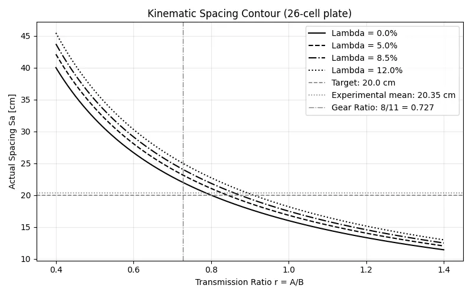
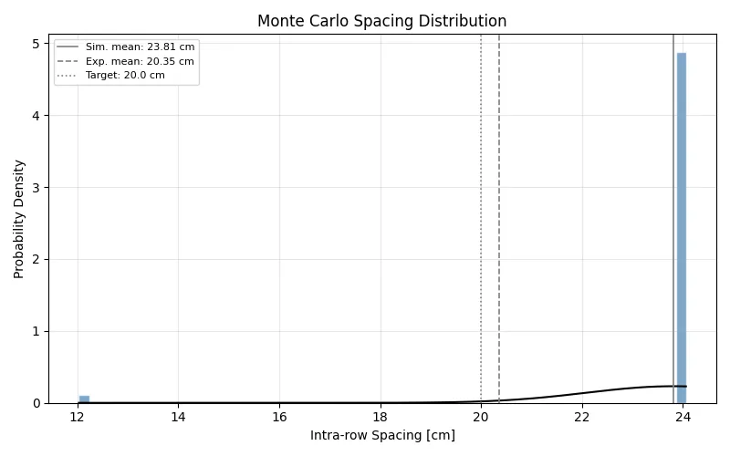

# Calibrated Stochastic Model for a Seed Metering Simulation

## 1. Project Overview
This repository contains a Python simulation of a **26-cell seed metering plate** design for a metering mechanism calibrated with gear configurations (ratios) from the Baldan PLB row planter manual. 

The project resolves the discrepancy between theoretical spacing of $20.0$ cm and the mean experimental field results of $20.35$ cm [1] by incoporating:
a) **Mechanical Tansmission:** Sprocket-to-plate ratios.
b) **Ground Wheel Slip ($\lambda$):** Modeling the interaction between soil and ground wheel.
c) **Stochastic Monte Carlo Model:** Accounts for the probablistc misses and double pickup events.

---
## 2. Methodology

### 2.1 Mechanical Transmission
The simulation treats the metering mechanism as a mechanically linked system. From the ground wheel through a chain-and-sprocket transmission. Plate rotation is derived from ground wheel travel confined to a specified gear ratio.

**Reference:** Intergrated **Baldan PLB Gear Table**

The number of seeds delivered in a meter is:

$$s_m = \frac{N \cdot r}{C_w}$$

Where $r$ is the transmission ratio

Theoretical intra-row spacing is therefore:

$$s_t = \frac{C_w}{N \cdot r}$$

**Transmission Equation:** 

$$S_{a} = \frac{1}{S_m \cdot (1 - \lambda)}$$

 Where $\lambda$ represents the ground-wheel slip coefficient.

### 2.2 Ground Wheel Slip
This occurs when the wheel rotates through an angle that reduces actual ground contaact and delivers less forward motion.

Actual spacing under slip is: 

$$S_a = \frac{s_t}{1 - \lambda}$$

### 2.3 Stochastic Model
To capture real-world disturbances, the model runs 10,000 trials and variablity through probabilistic pickup events is added. Each cell pass is modeled as a random draw from three outcomes:

**Event Probabilities:** 

a) Empty cell (p0): 0.04; 

b) Single seed (p1): 0.94; 

c) Double pickup (p2): 0.02;

The constraint: p0 + p1 + p2 = 1 is enforced

The total number of seeds for a give cell pass can be represented as: 

$$S_{total} = \sum_{i=1}^{N} X_i$$

Where $X$ is a discrete random variable with the probability mass function:

$$P(X=0) = 0.04$$

$$P(X=1) = 0.94$$

$$P(X=2) = 0.02$$

#### Simulation loop:
```python
    rng = np.random.default_rng(seed_ran)
    sa_cm = s_a(ratio, lam)*100
    outcomes = rng.choice([0, 1, 2], size = (n_trials, N_cells), 
                          p=[p0, p1, p2])
    spacings = []
    for trial in outcomes:
        for seeds in trial:
            if seeds == 0:
                continue
            spacings.append(sa_cm/seeds)
```

---

## 3. Figures 

<div align="center">

</div>

_Figure 1: Kinematic spacing contour for 26-cell plate for varrying wheel slip coefficients (source: Author, 2026)_

<div align="center">

</div>

_Figure 2: Simulated spacing distribution (source: Author, 2026)_

---

## Reference
[1] Zimba, W. Construction of a Metering System for Maize Seed using Additive Manufacturing Technology, (2024). Department of Agricultural Engineering, University of Zambia. _(Unpublished)_

---
## Licensing
This project is a computational extension of a Bachelor's thesis conducted at the University of Zambia (2024). The simulation computer programs are the work of the author. The experimental data referenced belongs to the associated thesis.
Please contact the author before redistributing
